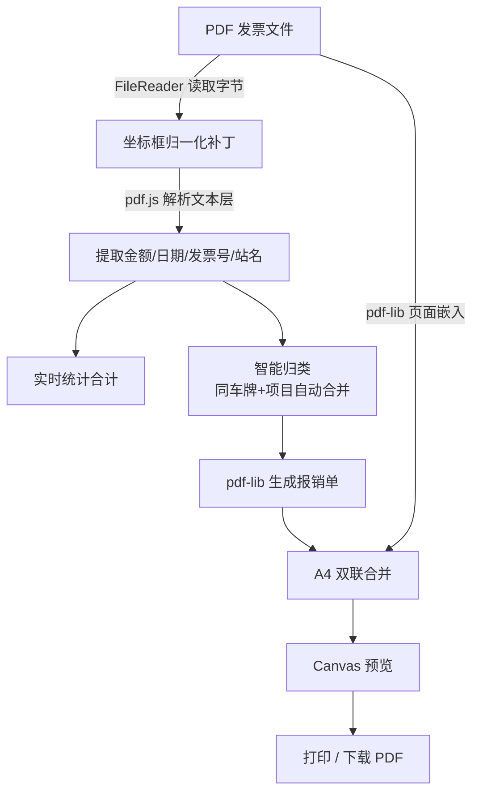

<div align="center">

# 🧾 发票打印助手

**专业的电子发票批量合并打印工具 —— 智能合并 · 自动识别 · 报销单生成 · 一键打印**

所有数据在浏览器本地处理，无需上传服务器，无登录，无使用限制。

[](https://lcofo.cn)
&nbsp;
[](https://lcofo.cn)
&nbsp;
[](./LICENSE)


</div>

---

## ✨ 亮点速览

| | 能力 | 说明 |
|:---:|:---|:---|
| 📥 | **批量合并** | 几十上百张 PDF 发票一次拖入，自动排进 A4 双联版面 |
| 🔍 | **自动识别** | 提取金额、日期、发票号，实时统计合计 |
| 📄 | **报销单生成** | 一键生成符合财务规范的报销单，含中文大写金额 |
| 🖨️ | **一键打印** | 合并后一次输出，省掉逐张打开、逐张打印 |
| 📑 | **同票多份** | 一键复制副本，绕过打印系统 MD5 去重 |
| 🔒 | **隐私安全** | 全程浏览器本地处理，发票不上传服务器 |

> 🌐 **在线直接使用**：<https://lcofo.cn> —— 打开即用，无需安装。

---

## 📑 目录

- [💢 它解决什么痛点](#-它解决什么痛点)
- [🆕 更新说明](#-更新说明)
- [🚀 功能详解](#-功能详解)
- [🧩 支持的发票类型](#-支持的发票类型)
- [⚡ 快速开始](#-快速开始)
- [🔄 使用流程](#-使用流程)
- [🧠 工作原理](#-工作原理)
- [📦 部署方式](#-部署方式)
- [🗂️ 项目结构](#️-项目结构)
- [🛠️ 技术架构](#️-技术架构)
- [🧱 自定义业务模块](#-自定义业务模块)
- [🔧 故障排除](#-故障排除)
- [❓ 常见问题](#-常见问题)
- [📜 许可证与版权](#-许可证与版权)

---

## 💢 它解决什么痛点

每到月末报销、季度申报，面对一堆电子发票，传统做法是这样的：

| 😩 传统方式 | ✨ 发票打印助手 |
|:---|:---|
| 一张一张双击打开 PDF | 全选拖入，一次导入几十上百张 |
| 一张一张点击打印、设置、提交 | 自动排版 A4 双联，点一次全部打印 |
| 一张一张查看、手动累加金额 | 自动识别金额，实时汇总合计 |
| 手工填写报销单、算中文大写 | 一键生成规范报销单，自动大写金额 |
| 满纸单张发票，浪费一半纸 | 每页 2 张，节省约 50% 纸张 |
| 上传第三方网站，担心信息泄露 | 全程浏览器本地处理，不上传服务器 |

> 一句话：把 **2–3 小时**的重复劳动，压缩成 **3–5 分钟**的三步操作。

---

## 🆕 更新说明

### `v6.1.0` · 2026-07-10

> 本次更新聚焦官网首页（`index.html`）的内容与体验优化，核心功能（`main.html`）未改动。

- 🎯 **新增「适用场景」板块** —— 图标卡片展示适用人群（中小企业财务 / 会计师事务所 / 代理记账 / 个体户报销人）与典型场景（月末报销 / 季度申报 / 金额核对 / 同票多份）
- ❓ **新增「常见问题 FAQ」板块** —— 6 条常见问题，配套 FAQPage 结构化数据
- 🏷️ **新增「电子发票类型」标签区** —— 覆盖增值税专普票、全电发票、铁路电子客票等
- 🔎 **SEO 优化** —— 首页内容扩充，补齐关键词与语义化结构，同步更新 `sitemap.xml`
- 📱 **全终端适配** —— 新增媒体溢出兜底与超小屏（≤380px）断点，覆盖手机 / 平板 / 桌面 / 大屏

<details>
<summary><b>📜 历史版本</b></summary>

### `v6.0.x` · 2026-06-25 —— 铁路电子客票（火车票）适配

- **票价识别**：新增「票价」金额识别模式，修复铁路客票因字段不同导致金额识别为 0 的问题
- **站名顺序**：按页面 x 坐标排序（左=出发站、右=到达站），修复报销单出发地/目的地写反
- **倒置修复**：新增坐标框归一化补丁，修复部分铁路客票 CropBox/MediaBox 坐标颠倒导致的渲染倒置（预览 / 合并 / 报销单全部受益）
- **稳定性**：修复 detached ArrayBuffer 报错，改用私有字节快照 + 每次返回新副本
- **部署兼容**：`nginx.conf` / `.htaccess` 支持 `.mjs` ES 模块（pdf.js worker）正确 MIME

</details>

---

## 🚀 功能详解

<table>
<tr><td width="50%" valign="top">

### 📥 批量上传与智能合并
- 支持 PDF 电子发票，拖拽或点击上传
- 自动合并为 A4 双联（每页 2 张），节省 50% 纸张
- 可选分割线，便于裁剪
- 清单位置可选：放最后 / 原地输出 / 抛弃清单
- CropBox 智能裁切，只嵌入可见内容

</td><td width="50%" valign="top">

### 🔍 自动识别与统计
- 自动提取每张发票的金额、日期、项目名称
- 识别价税合计、小写合计、应付金额等多种格式
- 实时统计面板显示发票数量与总金额
- 支持增值税专用 / 普通 / 全电发票

</td></tr>
<tr><td width="50%" valign="top">

### 📄 报销单生成
一键生成符合财务规范的报销单 PDF：
- **自动模式**：从发票提取数据直接生成
- **手动模式**：可修改项目、金额、日期后生成

包含标准表头、明细表格、中文大写合计、签章栏、自动分页页码，并与发票合并为一份可打印文件。

</td><td width="50%" valign="top">

### 🖨️ 打印 · 复制 · 导出
- **一键打印**：直接调用浏览器打印，输出完整 PDF
- **文件复制**：副本改尾部字节使 MD5 变化，绕过去重
- **CSV 导出**：导出发票号、金额、日期等统计字段
- **预览面板**：右侧滑出，支持缩放与完整预览

</td></tr>
</table>

---

## 🧩 支持的发票类型

`增值税专用发票` &nbsp; `增值税普通发票` &nbsp; `全电发票（数电票）` &nbsp; `铁路电子客票` &nbsp; `航空运输行程单` &nbsp; `机动车销售统一发票` &nbsp; `通行费电子发票` &nbsp; `餐饮/住宿/办公用品发票`

> 仅支持含可提取文本的 PDF 电子发票，扫描件、加密或损坏的 PDF 无法解析。

---

## ⚡ 快速开始

### 🌐 方式一：在线使用（推荐）

直接打开 **<https://lcofo.cn>**，无需安装，即开即用。

### 💻 方式二：本地运行

```bash
# 命令行启动
node server.js

# 或 Windows 下双击
启动服务器.bat   →   打开浏览器.bat
```

启动后访问 `http://localhost:8000/index.html`

<details>
<summary>📋 环境要求 & 端口修改</summary>

| 项目 | 要求 |
|------|------|
| 操作系统 | Windows 7 / 10 / 11 |
| 运行环境 | Node.js 12.0+ |
| 浏览器 | Chrome / Edge / Firefox |
| 磁盘空间 | 50MB 以上 |

修改端口：编辑 `server.js` 的 `PORT` 变量，或 `set PORT=3000 && node server.js`

</details>

---

## 🔄 使用流程


| 流程 | 步骤 |
|------|------|
| **基本打印** | 上传 → 自动合并 A4 双联 → 预览 → 打印/下载 |
| **报销单** | 上传 → 识别金额/日期 → 生成报销单 → 合并 → 下载/打印 |
| **多份打印** | 上传 → 点击复制 → 生成副本 → 一起合并打印 |

---

## 🧠 工作原理

发票的**识别、合并、打印全部在浏览器端完成**，不经过任何服务器：



- **文本提取**：用 `pdf.js` 读取 PDF 文本层，正则匹配「价税合计 / 小写 / 支付金额 / 票价」等多种字段，兼容增值税发票与铁路客票。
- **坐标归一化**：部分票据 CropBox/MediaBox 坐标颠倒，读取前统一修正，避免预览倒置。
- **PDF 合并**：用 `pdf-lib` 把每张发票嵌入 A4 版面（每页 2 张），报销单利用奇数页空白区拼接。
- **零上传**：全流程基于浏览器 `File API` + `ArrayBuffer`，关闭页面即清除，发票不离开本地。

---

## 📦 部署方式

<details>
<summary><b>本地 / 局域网</b></summary>

```bash
node server.js
# 局域网内其他设备访问：http://192.168.x.x:8000/main.html
# 需确保防火墙放行对应端口
```
</details>

<details>
<summary><b>Nginx 生产环境</b></summary>

项目附带 `nginx.conf`（支持 HTTPS），使用前修改：

- `server_name` — 你的域名
- `root` — 项目文件路径
- `ssl_certificate` / `ssl_certificate_key` — SSL 证书路径

```bash
nginx -t        # 测试配置
nginx -s reload # 重载
```
</details>

---

## 🗂️ 项目结构

```
📁 发票打印助手/
├── 📄 index.html              # 官网首页（SEO 落地页）
├── 📄 main.html               # 功能主页面（核心应用）
├── ⚙️ server.js               # Node.js 静态服务器（零依赖）
├── 🚀 启动服务器.bat / 打开浏览器.bat
├── ⚙️ nginx.conf / manifest.json / robots.txt / sitemap.xml
└── 📁 static/
    ├── 🎨 css/                # Tailwind 样式
    ├── 📜 js/
    │   ├── custom/            # 自定义功能模块
    │   │   ├── expense-report-core.js   # 数据提取 & 报销单
    │   │   ├── file-copy-print.js       # 文件复制 & 打印拦截
    │   │   ├── notifications.js         # Toast 通知
    │   │   ├── print-guard.js           # 打印拦截 & PDF 打印
    │   │   └── stats-widget.js          # 统计面板
    │   ├── invoice-tool-ui.js # 主 UI（React）
    │   ├── pdfjs-lib.js       # PDF 解析渲染
    │   └── ...                # React/Next.js 运行时
    ├── 🔤 font/               # 本地化 Geist 字体
    └── 🖼️ picture/            # 图片资源
```

---

## 🛠️ 技术架构

| 技术 | 用途 |
|------|------|
| `Next.js` 静态导出 | 应用框架，纯前端无后端 |
| `React` | UI 组件与状态管理 |
| `pdf-lib` | PDF 创建、合并、页面嵌入 |
| `pdfjs-dist` v4.8.69 | PDF 文本提取与页面渲染 |
| `html2canvas` + `jsPDF` | 报销单 HTML → PDF |
| `Tailwind CSS` | 样式系统 |
| `Node.js HTTP` | 静态文件服务器 |

> 💡 所有依赖已打包在 `static/js/`，**无需 `npm install`，无外部网络依赖**。
>
> ⚠️ PDF 字符映射（cmaps）首次从 CDN 加载，首次识别会稍慢（约 2–5 秒），之后浏览器缓存后恢复正常。

---

## 🧱 自定义业务模块

框架代码之外，核心业务逻辑手写在 `static/js/custom/`，独立可维护：

| 模块 | 职责 |
|------|------|
| `expense-report-core.js` | 发票数据提取、报销单 HTML 生成、PDF 合并、同车牌+项目智能归类 |
| `file-copy-print.js` | 文件复制（改尾部字节使 MD5 变化，绕过打印去重）、触发打印 |
| `print-guard.js` | 打印前检查与拦截，调用浏览器打印完整合并 PDF |
| `stats-widget.js` | 发票数量 / 金额统计面板渲染 |
| `notifications.js` | 全局 Toast 通知（复制、打印、生成等操作反馈） |

> 💡 业务逻辑与 Next.js/React 框架解耦，便于定位与二次开发。

---

## ❓ 常见问题

<details>
<summary><b>是免费的吗？需要注册或安装吗？</b></summary>

完全免费，无需注册、无需下载安装，也没有使用次数限制。打开 <https://lcofo.cn> 即可使用全部功能。
</details>

<details>
<summary><b>上传的发票会泄露吗？</b></summary>

不会。所有发票均在浏览器本地处理，不上传服务器、不存云端，关闭网页即清除，能有效保护财务信息安全。
</details>

<details>
<summary><b>支持哪些发票？识别不准怎么办？</b></summary>

支持增值税专用/普通发票、全电发票（数电票）、铁路电子客票、机动车销售统一发票等含可提取文本的 PDF。扫描件、加密或损坏的 PDF 无法解析。
</details>

<details>
<summary><b>同一张发票要打印多份怎么办？</b></summary>

点击文件旁的「复制」按钮创建副本，副本会修改尾部字节使 MD5 变化，绕过打印系统的重复文件校验，可创建多个，无数量限制。
</details>

<details>
<summary><b>能节省多少纸张？</b></summary>

采用 A4 双联版面，一张纸放上下两张发票，相比逐张打印约省 50% 纸张，可选裁剪分割线便于装订。
</details>

---

## 🔧 故障排除

<details>
<summary><b>页面空白 / 加载失败</b></summary>

- 确认服务器已启动（终端显示"服务器已启动"）
- 按 F12 检查控制台是否有资源加载错误
- 确认 `static/` 目录文件完整
</details>

<details>
<summary><b>端口被占用</b></summary>

- 修改 `server.js` 中的端口号
- 查看占用：`netstat -ano | findstr 8000`
</details>

<details>
<summary><b>发票识别不准 / 打印无反应 / 局域网无法访问</b></summary>

- **识别不准**：确保为标准电子发票（非扫描件），PDF 需含可提取文本
- **打印无反应**：确认浏览器未阻止弹窗，或改用下载后手动打印
- **局域网不通**：检查防火墙放行端口，使用服务器本机 IP 访问
</details>

---

## 📜 许可证与版权

<div align="center">

**版权所有 © 2025-2026 Tom-wc · 保留所有权利（All Rights Reserved）**

</div>

本项目源代码在 GitHub 公开 **仅供个人学习、研究与交流**，**未采用**任何开源许可证。
未经著作权人书面授权，**禁止商业使用、复制镜像、二次分发或发布竞争性衍生产品**。完整条款见 [LICENSE](./LICENSE)。

- 🌐 **官方站点**：<https://lcofo.cn>（免费在线使用全部功能）
- 📧 **商业授权 / 合作**：请通过官方站点页面的联系方式获取书面授权

> ⚠️ 本工具为纯前端应用，请认准官方域名 **lcofo.cn**，谨防仿冒站点。
